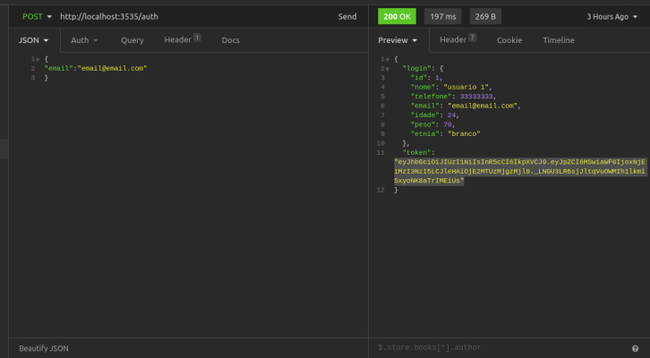

# Backend rest com postgres e autenticação

Api desenvolvida com express que cadastra usuarios e endereços no banco de dados postgresql.


## Setup

para instalar a api e exutar, use o seguinte comando:

```bash
yarn install
```


### Migrations

rode o comando abaixo para efetuar as migrations no Banco de Dados

```js
yarn typeorm migration:run
```

## uso

Api criada com TypeScript, autenticação jwt e banco de dados Postgresql.
contem rotas de criação e visualização de usuários e endereços, com um usuario podendo ter  varios endereços. A sessão de login
é feita apenas com algum endereço de email cadastrado, sem necessitar de senha, mas sem o token gerado pelo usuario, não é possivel visualizar a lista completa de usuários.
Avalidação de e-mail dos usuarios é feita pelo @IsEmail do Typeorm, e as etnias são cadastradas no banco com o formato ENUM.
 



Cauê Rafael Burgardt
